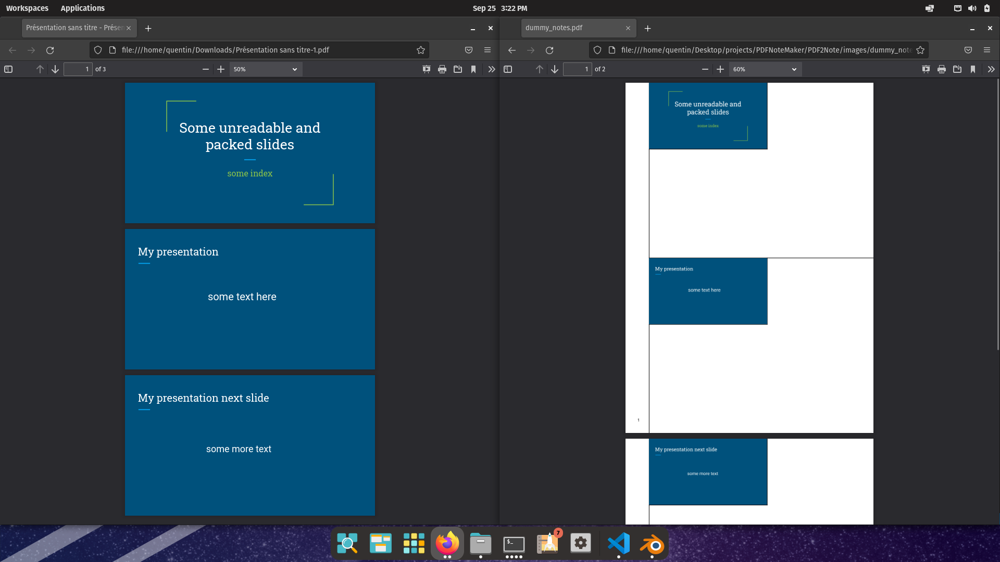

# PDF2Note
Convert a pdf into a more friendly document for taking notes (especially for slides).
Sometimes it's very hard to take notes on slides because of space and visual organisations constraints. It's also cumbersome to have a dedicated piece of paper that bookkeep the page number of the slide (which can be missing depending on the lecturer...). All of this is a nightmare for a overdisorganised person like me. Therefore, I made this small python script which convert a pdf (slides or not) into a set of "two-by-page" slides set. I found that the other alternatives such as Microsoft Power point would not fit for mathematical notes and geometrical drawing as the slides are too small, unreadable and there are printed lines which I hate. 



# Usage

```python PDF2Note.py --pdf_path <path to the source> --pdf_out <path to the target> --scale <int: size of the image> --margin <int: size of the margin> --indices <multiple possible selection as 1-3 5-10 etc>```

# Dependencies

This project uses pdf2image and fpdf libraries.

With conda:

```conda install -c conda-forge pdf2image fpdf```

With PIP:

```pip install pdf2image fpdf```

# Maybe todo

- Graphical interface to select pages
- Install system-wide
- Add header with name of the course etc...